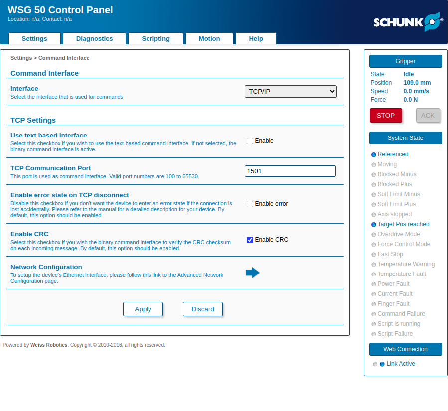

# ROS2 (humble) package for Schunk WSG50

## Setup
1. Setup IP for gripper and `ping 172.31.1.160`
2. Open web browser with `172.31.1.160` to open gripper config.  
3. Make sure that port number is `1501` as shown in the figure. 

    
4. Change launch file (*wsg50_driver/launch/gripper.launch.py*) according to the IP and Port number.

    ```
    declare_arguments.append(
        DeclareLaunchArgument(
            "gripper_ip",
            default_value="172.31.1.160",
            description="Gripper IP address",
        ),
    )

    declare_arguments.append(
        DeclareLaunchArgument(
            "port",
            default_value="1501",
            description="Gripper Port Number",
        ),
    )
    ```

## ToDo (wsg50_driver):
1. Currently `set(CMAKE_BUILD_TYPE Debug)` is set in CMakeLists.txt to avoid `**overload**`. 
2. The error occures in file `msg.cpp` line **62**, if `set(CMAKE_BUILD_TYPE Debug)` is not set or cmake build type is *Release*.
3. Client goal response is not called until timer is cancelled. 